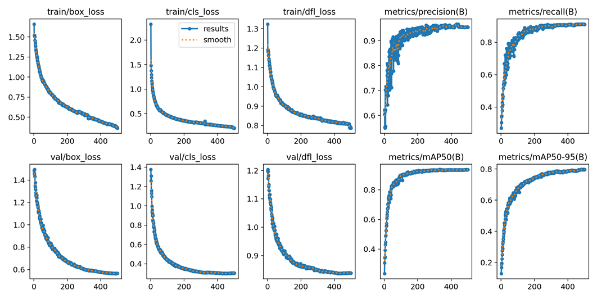

# traffic-i

## Introduction
In this project, we aim to develop a comprehensive traffic monitoring system that detects and counts vehicles, identifies license plates, and recognizes license plate characters using YOLOv8. This system can be applied in real-time traffic management, law enforcement, and smart city infrastructure to track vehicle movements and ensure road safety compliance.
## Goals
- Detect various types of vehicles (e.g., cars, buses, trucks, etc.) and their corresponding license plates from traffic videos.
- Recognize license plate characters.
- Count the number of vehicles passing through using the ByteTrack algorithm for multi-object tracking.
## Contributors
## Project Architecture
1. **Vehicle and License Plate Detection**:  
   A YOLOv8-based model is trained to detect multiple vehicle types (e.g., cars, buses, trucks) and license plates in real-time.

2. **License Plate Recognition**:  
   After detecting the license plates, a character-level detection model processes the cropped license plate images to recognize the characters.

3. **Vehicle Counting**:  
   The ByteTrack algorithm is used to track vehicles across frames and count the total number of vehicles in the video.

### Pipeline Overview
The system pipeline operates as follows:
1. **Input video frame**: A traffic video is provided as input to the system.
2. **Vehicle and license plate detection using YOLOv8**: The YOLOv8 model detects various vehicles and license plates.
3. **Cropping detected license plates**: Detected license plates are cropped for further processing.
4. **License plate character recognition**: Cropped license plates are passed through an OCR model to recognize and extract characters.
5. **Counting the number of vehicles using ByteTrack**: The ByteTrack algorithm tracks and counts vehicles over time.
---

# Status
- Vehicle and license plate detection: Completed
- License plate character recognition: Completed
- Vehicle counting: Completed
# Data Source

This project utilizes two datasets for training and evaluation:

1. **[Vehicle and LP Detection Dataset](https://universe.roboflow.com/anand-nl5uw/data2-gy08l):**  
   This dataset contains annotated images for detecting various vehicle types such as cars, buses, trucks, and more. It is used for training the model to detect vehicles and license plates.
2. **[License Plate Character Recognition Dataset](https://universe.roboflow.com/lp-1sbdy/lp-h76ik):**  
   This dataset contains annotated license plate texts.

## Code Structure
The repository is organized into the following directories:
- **docs/**: Contains project-related documentation.
- **notebook/**: Includes Jupyter notebooks used for training the vehicle and license plate detection models.
- **tests/**: Contains the testing code for running inference on videos and validating the system.
## Artifacts Location
The following artifacts are available for download from Google Drive. These include the model weights used for vehicle detection, license plate detection, and license plate character recognition:
- [link](https://drive.google.com/drive/folders/1zhybja68Wg5LCsr8ejSa1NAcUmcEAvBd?usp=sharing)
# Results

---

---

---
## Metrics Used
## Evaluation Results
### yolov8 vehicle and license plate detection results

---
### yolov8 license plate text detection results

